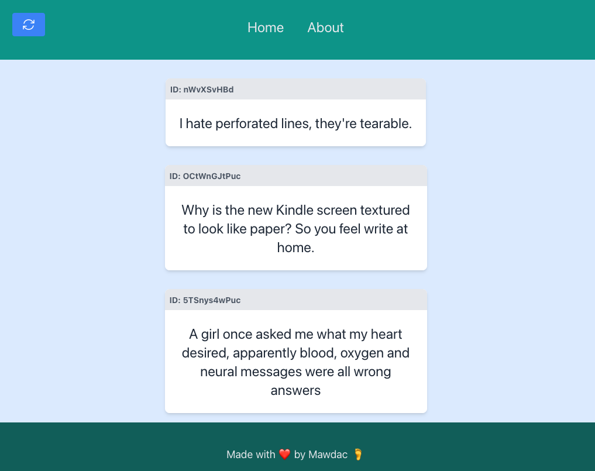

# Dad Jokes

This is a full-stack dad joke application. Everything you've ever dreamed of.

It pulls dad jokes from the web, stores them in a local mongoDB instance, and
allows you to view them from a simple UI in your browser.



Each piece is written with Golang. This is a work-in-progress, meant only to be
a project for learning full-stack go apps. Feel free to poke around.

## Development

### Pre-requisites

- Docker & Docker Compose
- go 1.22.0+

### Backend

From the root of the project, just run `docker compose watch` to start all of
the backend components.

### Frontend

The frontend runs separately currently. To run it with hot-reloading, first
install [air](https://github.com/cosmtrek/air)

```sh
go install github.com/cosmtrek/air@latest
```

Then you can run the UI using it (assuming you've added the `$GOPATH/bin`
folder to your path)

```sh
cd ui/
air
```

## Architecture

### Collectors

Collects dad jokes from [the internetz](https://icanhazdadjoke.com) and writes
it to the database via the API. Each time it runs, a new joke is added.

### API

Initially written with Gin, allows read and write of jokes to the database.

### Database

MongoDB

### UI

- [Templ](https://templ.guide/)
- [Tailwind](https://tailwindcss.com/)
- [HTMX](https://htmx.org/)

## TODO

- [ ] Refactor DB API to use Chi instead of Gin
